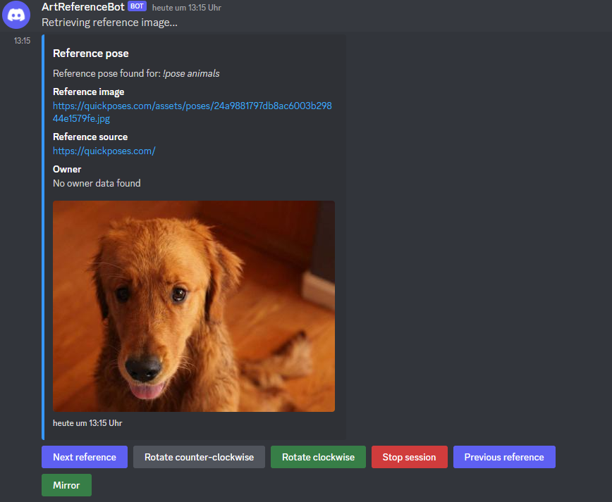
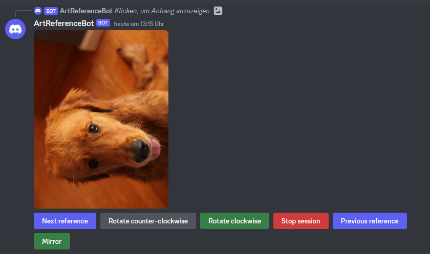
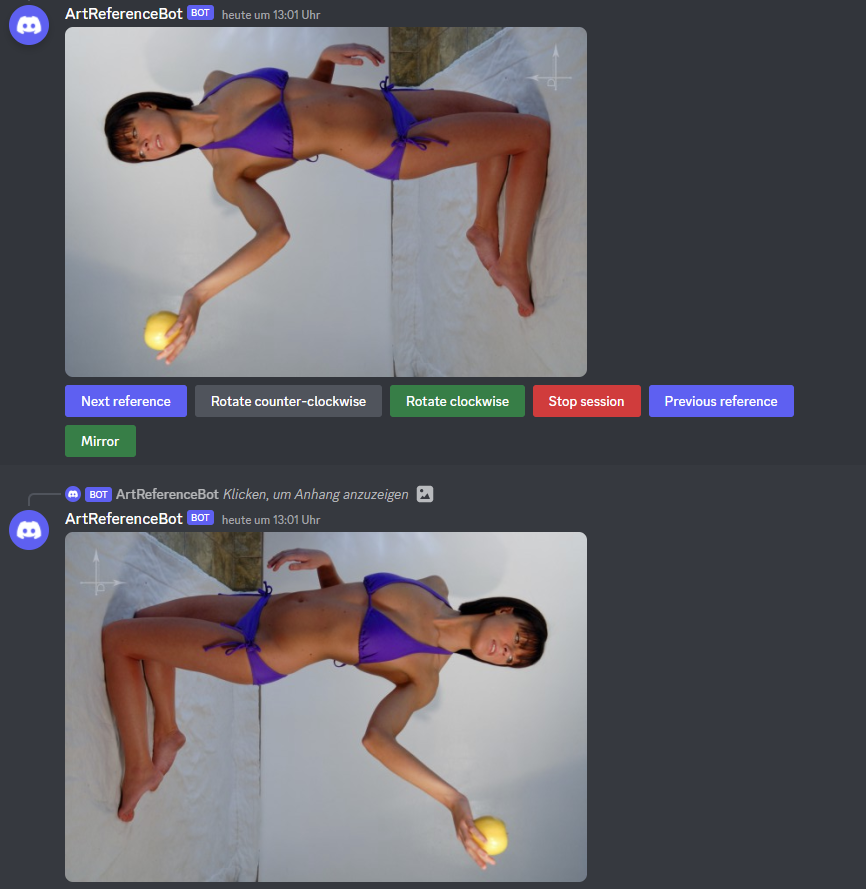

# ArtModelBot
Discord bot that let artists retrieve reference images in discord from https://quickposes.com.

- Installation:
  -
  
  - Prerequisite:
    
    - Create your own bot application in the discord developer portal: https://discord.com/developers/applications
    - Copy your bot token
    - Clone the repo
  - Install all dependencies by your own:
  - Install Node.js
  - Run:
   
        npm install 
        npm run start

  - Using the given Dockerfile with following command:
 
          docker build . --build-arg bottoken='<Enter your discord bot token here>'
- Features:
  - 

  - Pose reference retrieval from https://quickposes.com with further information like owner and url of the reference
  
    -Available commands:
    ```
    !pose help <-- Returns an overview of all available pose commands
    !pose animals <-- Returns a random animal reference
    !pose urban <-- Returns a random urban reference
    !pose face <all, female, male> <-- Returns a random face reference
    !pose hands <all, female, male> <-- Returns a random hand reference
    !pose pose <all, female male> <all, nude&partiallynude, clothes&costumes> <-- Returns a random pose reference
    ```
    
  - The bot lets you execute transformations and further actions on the retrieved reference over the displayed buttons:
    

    - Rotation (:unamused:):
      
    - Mirroring:
       
    - Retrieve a new reference for that command
    - Stop the session
    - Retrieve previous reference

> &copy; 2023 Florian Pfützenreuter
